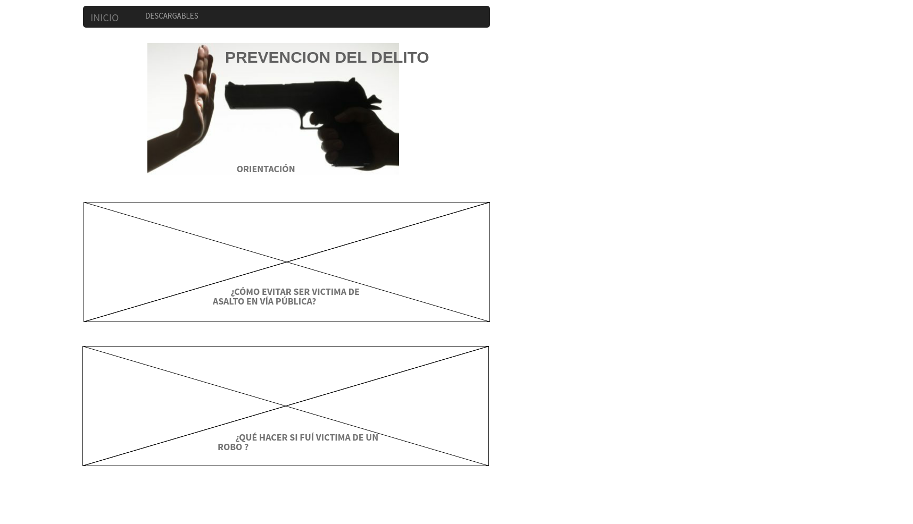

# **PLATAFORMA DE SEGURIDAD CIUDADANA**

1. DETECCION DEL PROBLEMA 

  Ante la onda de violencia que vive la Ciudad de México y el aumento de asaltos y robos en vía pública, intentaremos 
 concientizar a la población sobre como actuar para prevenir el robo en vía pública, que hacer cuando somos victima de 
 esta situación y sensibilizar a la población sobre cultura civica.

2. POBLACIÓN AFECTADA 

  Aunque cualquier persona pueda ser victima del robo en vía pública hay sectores poblacionales en que este ante esta 
problematica son más vulnerables ante esta situación como son las mujeres, los niños y l@s ancion@s.

3. SOLUCIONES A L APROBLEMATICA 

  Crear un sitio web intereactivo que oriente a las personas en que hacer para evitar ser victima del robo en vía pública,
o si es victima dle robo que hacer como contactar a las autoridades pertinentes, y sensibilizar a las población sobre la cultura
civica.

4. SECCIONES QUE ABARCARA NUESTRO PROYECTO 
El proyecto consiste en una plataforma que ofrezca al usuario información relevante sobre temas de seguridad pública,como lo son:

1. Números de emergencia.
2. Ubicación del módulo de policía más cercano y los numeros de contacto con la policia.
3. Enlace con información necesaria para denunciar un delito ante Ministerio Público.
4. Mapa de riesgo.
5. Materiales descargables orientados a cultura cívica y prevención del delito (enfocada a la población más vulnerable).

* Página principal

* Página de orientación 

